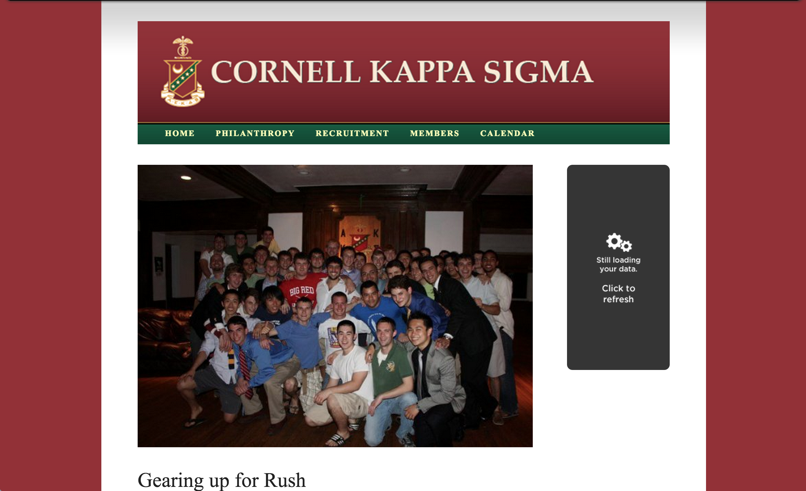

# [Cornell Kappa Sigma](http://cornellkappasig.com/)

Kappa Sigma, Alpha Kappa Chapter is a social fraternity at Cornell University, founded in 1892 and located in the stately mansion on 600 University Ave. in Ithaca since 1903. This repository documents its online website structure. This site is organized as a Jekyll installation to take advantage of Github Pages' awesome free hosting offering. By structuring it this way, we are able to omit our subscription from Squarespace and save about $200 a year (money that can go to social, hoooraah), while adding more flexibility for what we can do with our website.

## Compiling
To simplify the repeating nature of the data for the website, preprocessing is used to generate the markup using all of the brothers' information. The configuration file for the brothers' info is in the `src/config` file. To generate the homepage markup from the configuration, navigate to the root directory of the project and run (Node must be installed):

```
$ node compile
```

## Style Developement

The [SASS](http://sass-lang.com/) structure uses Jekyll's built-in SASS compiling so precompiling happens automatically before Jekyll serves the site. To develop styles for the site, navigate to the root directory of the project in Terminal and serve the site ([Jekyll](http://jekyllrb.com/) must be installed):

```
$ jekyll serve
```

## License

Cornell Kappa Sigma is [MIT licensed](./LICENSE?raw=true) and is available for public use by anybody who wants to use this repo for their own work.

## Version Screenshots

**Version 2.0** *Current* (2015)


**Version 1.0** (2011)



AEKDB

<!-- Missing Photos: Richard Li -->